<div align="center">

# 🧠 Panic-Proof Planner

### *AI-powered productivity that adapts to how your brain actually works.*

> Stop fighting your schedule. Start working with your mood, energy, and personality — not against them.

<br/>

<!-- Replace with your actual hero image -->
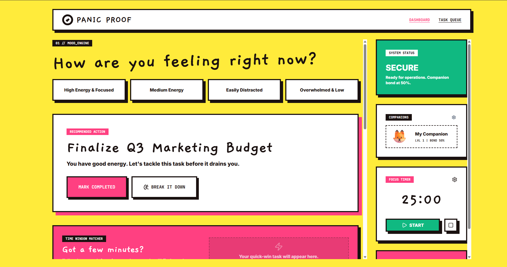

<br/>

[](https://panic-proof-278435063776.asia-southeast1.run.app
)
[](https://your-video-link.here)
[](#installation)

<br/>


</div>

---

## 📌 Project Overview

**Panic-Proof Planner** is a multi-agent, AI-powered productivity web application that dynamically adapts to your emotional state, personality type, and energy levels — delivering a schedule that works *with* you, not against you.

Most productivity tools are built on the assumption that you're a machine: consistent, rational, and infinitely productive. Real humans aren't. **Executive dysfunction, ADHD, burnout, and decision fatigue** cause even the most capable people to spiral into inaction. Traditional apps respond to this by adding more features, more notifications, more guilt.

Panic-Proof Planner responds differently — it *listens*.

By combining **Google's Gemini API** with a mood-tracking engine, a personality profiling system, and an adaptive AI planner, Panic-Proof Planner generates hyper-personalized task schedules and compassionate AI companions that respond to exactly where you are *right now*.

Built for the **Google AI Studio Hackathon**, this application demonstrates what happens when multi-agent AI meets emotionally intelligent UX.

---

## 🆚 Why Panic-Proof Planner?

<table>
<thead>
<tr>
<th>⚠️ Traditional Productivity Apps</th>
<th>✅ Panic-Proof Planner</th>
</tr>
</thead>
<tbody>
<tr>
<td>One-size-fits-all scheduling</td>
<td>Mood-adaptive, personality-aware scheduling</td>
</tr>
<tr>
<td>Rigid time-blocking with no emotional context</td>
<td>Time Window Matcher aligns tasks with your energy peaks</td>
</tr>
<tr>
<td>Overwhelms users with large task lists</td>
<td>AI Breakdown decomposes tasks into micro-steps</td>
</tr>
<tr>
<td>Ignores ADHD, anxiety, and executive dysfunction</td>
<td>Panic Mode designed specifically for dysregulation moments</td>
</tr>
<tr>
<td>Static notifications, no emotional intelligence</td>
<td>Companion agent responds to your current mood state</td>
</tr>
<tr>
<td>Fixed Pomodoro timers for everyone</td>
<td>Pomodoro intervals adjusted for personality & focus type</td>
</tr>
<tr>
<td>No feedback loop between emotion and task priority</td>
<td>Mood Engine continuously feeds AI context for scheduling</td>
</tr>
<tr>
<td>Treats burnout as a productivity failure</td>
<td>Celebrates rest as a strategy, not a weakness</td>
</tr>
</tbody>
</table>

---

## ✨ Key Features

<details open>
<summary><strong>Click to expand all features</strong></summary>

<br/>

### 🧩 Personality Test
| Attribute | Detail |
|---|---|
| **Description** | Onboarding questionnaire that profiles your cognitive and emotional productivity style |
| **User Benefit** | Every AI recommendation is calibrated to your unique personality type |
| **Engine** | Rule-based with AI interpretation via Gemini |
| **Screenshot** |  |

---

### 🌡️ Mood Engine
| Attribute | Detail |
|---|---|
| **Description** | Real-time mood check-in system that captures your current emotional and energy state |
| **User Benefit** | Ensures your schedule reflects how you *actually* feel, not how you *should* feel |
| **Engine** | AI-powered context injection into Gemini scheduling prompts |
| **Screenshot** | 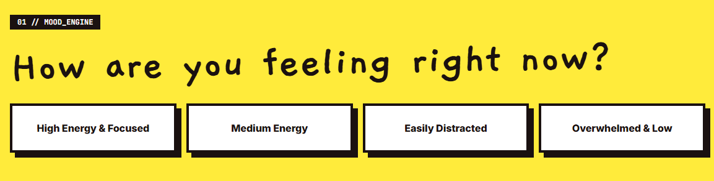 |

---

### 📅 AI Schedule Generator
| Attribute | Detail |
|---|---|
| **Description** | Multi-agent Gemini pipeline that creates a fully structured daily schedule based on tasks, mood, personality, and available time windows |
| **User Benefit** | No more decision fatigue — your optimal schedule is generated in seconds |
| **Engine** | Gemini API (multi-agent, structured JSON output) |
| **Screenshot** | 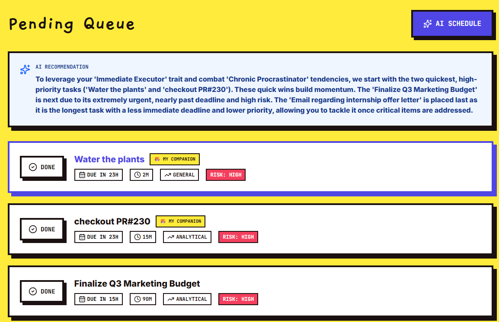 |

---

### 🔬 AI Task Breakdown
| Attribute | Detail |
|---|---|
| **Description** | Decomposes any overwhelming task into small, actionable micro-steps via Gemini |
| **User Benefit** | Eliminates the paralysis of "I don't know where to start" |
| **Engine** | Gemini API (structured step-by-step JSON) |
| **Screenshot** | 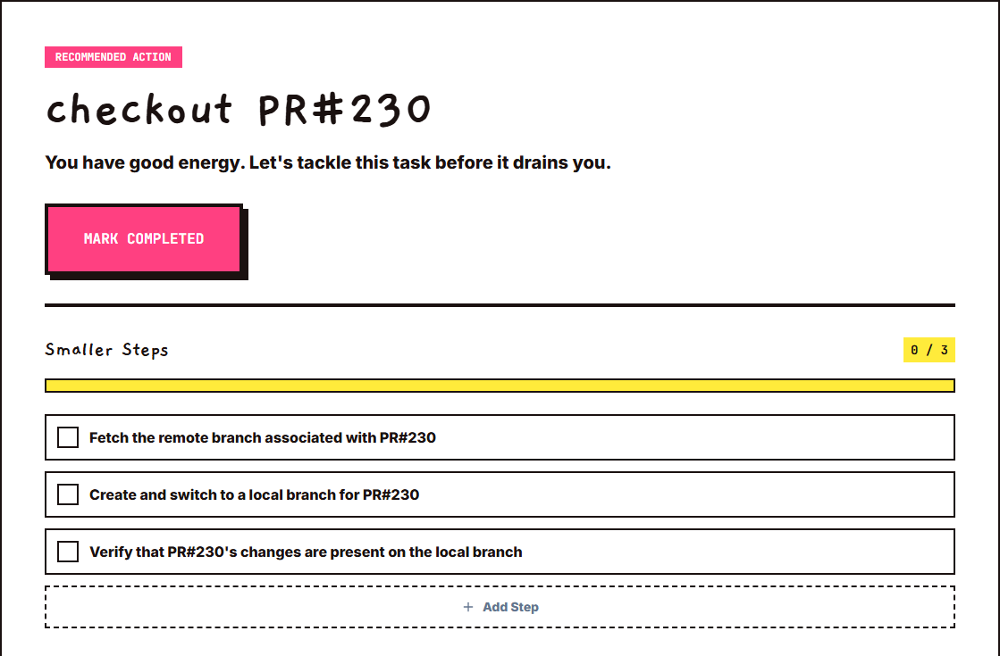 |

---

### 🤝 AI Companion
| Attribute | Detail |
|---|---|
| **Description** | A conversational AI agent that provides emotional support, motivation, and guidance calibrated to your current mood and personality |
| **User Benefit** | You always have a non-judgmental, context-aware productivity coach |
| **Engine** | Gemini API (conversational agent with memory context) |
| **Screenshot** | 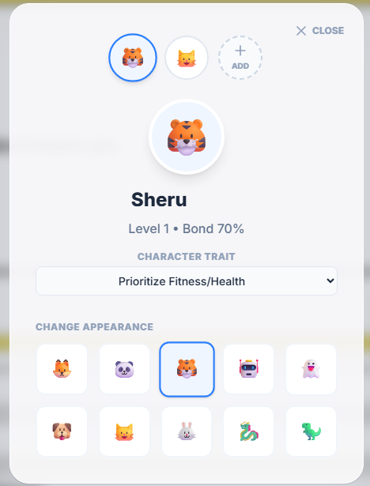 |

---

### 🚨 Panic Mode
| Attribute | Detail |
|---|---|
| **Description** | Emergency intervention mode for moments of overwhelm, anxiety, or executive dysfunction — offers grounding steps and a minimal, distraction-free task view |
| **User Benefit** | Prevents full shutdown when feeling overwhelmed, with compassionate AI redirection |
| **Engine** | AI-powered (Gemini) + rule-based grounding protocols |
| **Screenshot** | 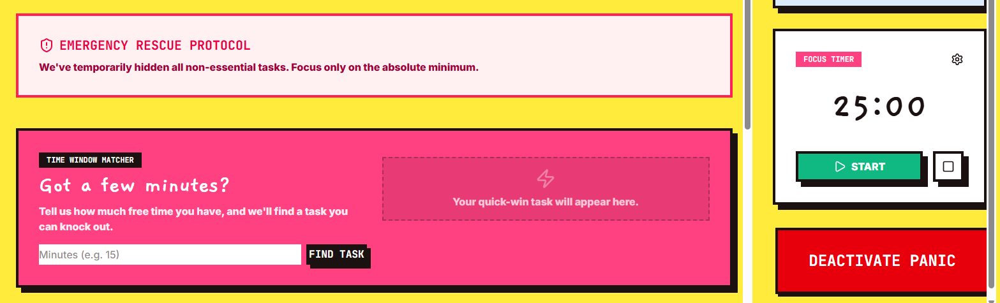 |

---

### 🍅 Adaptive Pomodoro Timer
| Attribute | Detail |
|---|---|
| **Description** | Focus timer with interval durations adapted to your personality profile and current mood |
| **User Benefit** | Maintains sustainable focus without forcing neurotypical work patterns on everyone |
| **Engine** | Rule-based + personality context |
| **Screenshot** | 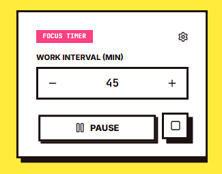 |

---

### 🕐 Time Window Matcher
| Attribute | Detail |
|---|---|
| **Description** | Analyzes your available time slots and aligns them with task complexity and estimated cognitive load |
| **User Benefit** | High-focus tasks land in your peak hours; low-stakes tasks fill energy dips |
| **Engine** | AI-assisted scheduling logic via Gemini |
| **Screenshot** | 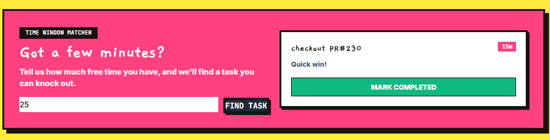 |

</details>

---

## 🎬 Demo

<div align="center">

### Application Demo


<br/>

| Dashboard | Mood Engine | AI Schedule |
|---|---|---|
|  | 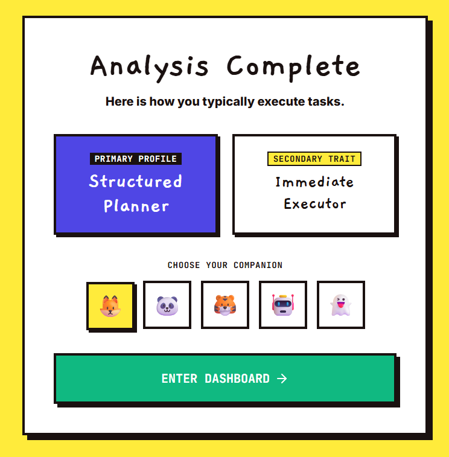 |  |

| AI Breakdown | Companion | Panic Mode |
|---|---|---|
|  |  |  |

| Pomodoro | | |
|---|---|---|
|  | | |

</div>

---

## 🗺️ User Journey

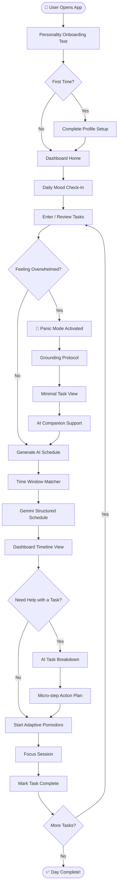

---

## 🏗️ System Architecture

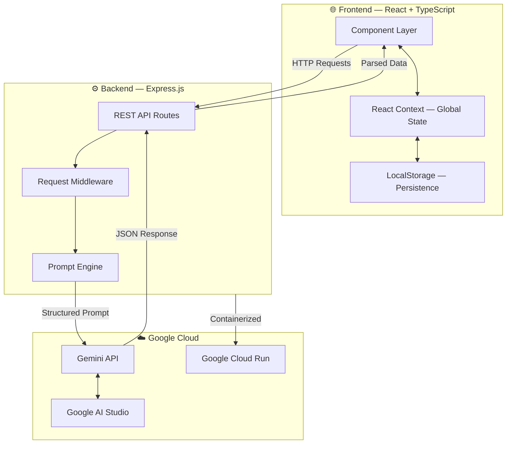

---

## 🤖 AI Workflow

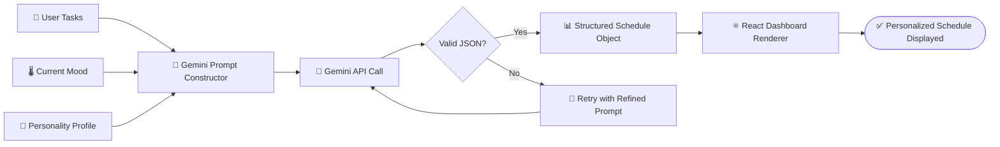

**How It Works:**

1. **Input Collection** — The app gathers three context streams: your task list, your current mood rating, and your personality profile.
2. **Prompt Construction** — The Express backend assembles a precisely engineered prompt that encodes all three context streams, along with available time windows.
3. **Gemini Processing** — The Gemini API processes the multi-context prompt through its reasoning engine, returning a structured JSON schedule.
4. **Validation & Retry** — If the response fails JSON schema validation, the prompt engine automatically retries with a refined prompt.
5. **Rendering** — The React frontend parses the validated JSON and renders the schedule with animations and interactive controls.

---

## 🧩 Component Architecture

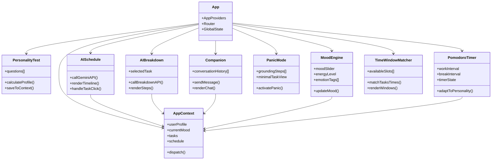

---

## 📁 Folder Structure

```
panic-proof-planner/
│
├── 📂 client/                          # React + TypeScript frontend
│   ├── 📂 src/
│   │   ├── 📂 components/              # Reusable UI components
│   │   │   ├── 📂 ui/                  # Base design system components
│   │   │   ├── Companion.tsx           # AI companion chat interface
│   │   │   ├── MoodEngine.tsx          # Mood check-in component
│   │   │   ├── PanicMode.tsx           # Emergency intervention UI
│   │   │   ├── PersonalityTest.tsx     # Onboarding questionnaire
│   │   │   ├── PomodoroTimer.tsx       # Adaptive focus timer
│   │   │   └── TimeWindowMatcher.tsx  # Time slot alignment UI
│   │   │
│   │   ├── 📂 context/                 # React Context — global state
│   │   │   └── AppContext.tsx
│   │   │
│   │   ├── 📂 pages/                   # Route-level page components
│   │   │   ├── Dashboard.tsx
│   │   │   ├── Schedule.tsx
│   │   │   ├── Breakdown.tsx
│   │   │   └── Onboarding.tsx
│   │   │
│   │   ├── 📂 hooks/                   # Custom React hooks
│   │   ├── 📂 utils/                   # Helpers and utilities
│   │   ├── 📂 types/                   # TypeScript type definitions
│   │   ├── 📂 styles/                  # Tailwind configuration
│   │   ├── App.tsx
│   │   └── main.tsx
│   │
│   ├── index.html
│   ├── tailwind.config.ts
│   ├── tsconfig.json
│   └── vite.config.ts
│
├── 📂 server/                          # Express.js backend
│   ├── 📂 routes/                      # API route handlers
│   │   ├── schedule.ts                 # Schedule generation endpoint
│   │   ├── breakdown.ts               # Task breakdown endpoint
│   │   ├── companion.ts               # Companion chat endpoint
│   │   └── panic.ts                   # Panic mode endpoint
│   │
│   ├── 📂 services/                    # Business logic & Gemini integration
│   │   ├── geminiService.ts            # Gemini API wrapper
│   │   └── promptEngine.ts            # Prompt construction logic
│   │
│   ├── 📂 middleware/                  # Express middleware
│   ├── 📂 types/                       # Shared TypeScript types
│   ├── index.ts
│   └── .env.example
│
├── 📂 shared/                          # Shared types between client & server
│   └── types.ts
│
├── Dockerfile
├── .dockerignore
├── package.json
└── README.md
```

---

## 🛠️ Tech Stack

<table>
<thead>
<tr>
<th>Category</th>
<th>Technology</th>
<th>Purpose</th>
</tr>
</thead>
<tbody>
<tr>
<td><strong>Frontend</strong></td>
<td>React 18 + TypeScript</td>
<td>Component-based UI with full type safety</td>
</tr>
<tr>
<td><strong>Styling</strong></td>
<td>Tailwind CSS</td>
<td>Utility-first responsive design system</td>
</tr>
<tr>
<td><strong>Animations</strong></td>
<td>Framer Motion</td>
<td>Smooth, physics-based UI transitions</td>
</tr>
<tr>
<td><strong>Backend</strong></td>
<td>Express.js (Node.js)</td>
<td>REST API server, prompt routing, Gemini proxy</td>
</tr>
<tr>
<td><strong>AI Engine</strong></td>
<td>Google Gemini API</td>
<td>Multi-agent schedule generation, breakdown, companion</td>
</tr>
<tr>
<td><strong>AI Platform</strong></td>
<td>Google AI Studio</td>
<td>Prompt engineering, model selection, API management</td>
</tr>
<tr>
<td><strong>State Management</strong></td>
<td>React Context API</td>
<td>Lightweight global state without external dependencies</td>
</tr>
<tr>
<td><strong>Persistence</strong></td>
<td>LocalStorage</td>
<td>Client-side session and profile persistence</td>
</tr>
<tr>
<td><strong>Deployment</strong></td>
<td>Google Cloud Run</td>
<td>Serverless containerized deployment</td>
</tr>
<tr>
<td><strong>Containerization</strong></td>
<td>Docker</td>
<td>Reproducible build and deployment environment</td>
</tr>
<tr>
<td><strong>Build Tool</strong></td>
<td>Vite</td>
<td>Lightning-fast frontend bundling and HMR</td>
</tr>
<tr>
<td><strong>Language</strong></td>
<td>TypeScript</td>
<td>End-to-end type safety across client and server</td>
</tr>
</tbody>
</table>

---

## 🌐 Google Technologies

### 🔵 Google AI Studio
Google AI Studio serves as the development and experimentation backbone of Panic-Proof Planner. All Gemini prompts were engineered, tested, and iterated inside AI Studio before being hardened into the production prompt engine. AI Studio's model playground enabled rapid prototyping of multi-context prompt architectures, ensuring that personality, mood, and task data were being synthesized correctly before the API integration was built.

### 🟣 Gemini API
The Gemini API is the intelligence layer of the entire application. It powers four distinct AI agents:

| Agent | Role |
|---|---|
| **Schedule Agent** | Generates a complete, structured daily schedule from mood + personality + tasks |
| **Breakdown Agent** | Decomposes complex tasks into ordered, manageable micro-steps |
| **Companion Agent** | Provides emotionally calibrated conversational support and motivation |
| **Panic Agent** | Delivers grounding protocols and minimal task prioritization during overwhelm |

All agents return **structured JSON**, ensuring reliable parsing and graceful error handling.

### 🟡 Google Cloud Run
The Express.js backend is containerized with Docker and deployed on **Google Cloud Run**, providing:
- Fully managed, serverless container execution
- Automatic scaling from zero to handle burst traffic
- Secure environment variable injection for API keys
- Zero cold-start infrastructure management

---

## 📡 API Documentation

<details>
<summary><strong>View all API endpoints</strong></summary>

<br/>

### `POST /api/schedule`

Generates a personalized AI daily schedule.

| Field | Detail |
|---|---|
| **Method** | POST |
| **Route** | `/api/schedule` |
| **Purpose** | Generate a Gemini-powered structured daily schedule |

**Request Body:**
```json
{
  "tasks": [{ "id": "string", "title": "string", "estimatedTime": "number", "priority": "high|medium|low" }],
  "mood": { "rating": "number (1-10)", "energy": "number (1-10)", "tags": ["string"] },
  "personality": { "type": "string", "focusStyle": "string", "breakPreference": "string" },
  "timeWindows": [{ "start": "HH:MM", "end": "HH:MM" }]
}
```

**Response:**
```json
{
  "schedule": [
    {
      "taskId": "string",
      "title": "string",
      "startTime": "HH:MM",
      "endTime": "HH:MM",
      "notes": "string"
    }
  ]
}
```

**Errors:** `400 Bad Request` · `500 Gemini API Error`

---

### `POST /api/breakdown`

Breaks down a task into micro-steps.

| Field | Detail |
|---|---|
| **Method** | POST |
| **Route** | `/api/breakdown` |
| **Purpose** | Decompose an overwhelming task into actionable steps |

**Request Body:**
```json
{
  "task": { "title": "string", "description": "string" },
  "mood": { "rating": "number", "energy": "number" },
  "personality": { "type": "string" }
}
```

**Response:**
```json
{
  "steps": [
    { "order": "number", "action": "string", "estimatedMinutes": "number" }
  ]
}
```

**Errors:** `400 Bad Request` · `500 Gemini API Error`

---

### `POST /api/companion`

Sends a message to the AI Companion agent.

| Field | Detail |
|---|---|
| **Method** | POST |
| **Route** | `/api/companion` |
| **Purpose** | Conversational AI support calibrated to mood and personality |

**Request Body:**
```json
{
  "message": "string",
  "history": [{ "role": "user|assistant", "content": "string" }],
  "mood": { "rating": "number", "tags": ["string"] },
  "personality": { "type": "string" }
}
```

**Response:**
```json
{
  "reply": "string"
}
```

**Errors:** `400 Bad Request` · `500 Gemini API Error`

---

### `POST /api/panic`

Activates Panic Mode and returns grounding content.

| Field | Detail |
|---|---|
| **Method** | POST |
| **Route** | `/api/panic` |
| **Purpose** | Generate grounding steps and a minimal prioritized task view |

**Request Body:**
```json
{
  "tasks": [{ "id": "string", "title": "string", "priority": "string" }],
  "personality": { "type": "string" }
}
```

**Response:**
```json
{
  "groundingSteps": ["string"],
  "priorityTask": { "id": "string", "title": "string", "firstStep": "string" }
}
```

**Errors:** `400 Bad Request` · `500 Gemini API Error`

</details>

---

## 🚀 Installation

### Prerequisites

| Requirement | Version |
|---|---|
| Node.js | ≥ 18.x |
| npm | ≥ 9.x |
| Google Gemini API Key | [Get one here](https://aistudio.google.com/app/apikey) |
| Docker (optional) | For containerized deployment |

---

### 1. Clone the Repository

```bash
git clone https://github.com/yourusername/panic-proof-planner.git
cd panic-proof-planner
```

### 2. Install Dependencies

```bash
# Install all dependencies (client + server)
npm install
```

### 3. Configure Environment Variables

```bash
cp server/.env.example server/.env
# Edit server/.env and add your API key
```

### 4. Development Mode

```bash
# Start both frontend and backend concurrently
npm run dev
```

Frontend: `http://localhost:5173`
Backend: `http://localhost:3000`

### 5. Production Build

```bash
npm run build
npm run start
```

### 6. Docker Deployment

```bash
docker build -t panic-proof-planner .
docker run -p 3000:3000 --env-file server/.env panic-proof-planner
```

---

## 🔐 Environment Variables

| Variable | Required | Description |
|---|---|---|
| `GEMINI_API_KEY` | ✅ Yes | Your Google Gemini API key from AI Studio |
| `PORT` | ✅ Yes | Port for the Express server (default: `3000`) |
| `NODE_ENV` | ✅ Yes | `development` or `production` |
| `CORS_ORIGIN` | ⚠️ Recommended | Frontend origin URL for CORS (e.g., `http://localhost:5173`) |

> 🔒 **Never commit your `.env` file.** Add it to `.gitignore`. Use Google Cloud Secret Manager for production deployments.

---

## 🧠 Architecture Decisions

<details>
<summary><strong>Why React Context instead of Redux or Zustand?</strong></summary>

Panic-Proof Planner's state shape is relatively flat — mood, personality, tasks, and schedule — without deeply nested or high-frequency update trees. React Context with `useReducer` provides the right balance of simplicity, zero external dependencies, and full TypeScript compatibility. For a hackathon-scoped project, this eliminates boilerplate while remaining fully scalable.

</details>

<details>
<summary><strong>Why Gemini API over OpenAI GPT?</strong></summary>

This project was built for the **Google AI Studio Hackathon**, making Gemini the natural and required choice. Beyond that, Gemini's large context window and strong structured JSON output reliability make it ideal for the multi-context prompt architecture this app requires — encoding tasks, mood, and personality simultaneously in a single coherent prompt.

</details>

<details>
<summary><strong>Why Express.js as a backend proxy?</strong></summary>

Calling the Gemini API directly from the browser would expose the API key in client-side code. The Express server acts as a secure proxy: it receives frontend requests, injects the API key server-side, constructs structured prompts, and forwards them to Gemini. This also centralizes prompt engineering logic, keeping the frontend clean.

</details>

<details>
<summary><strong>Why LocalStorage for persistence?</strong></summary>

For a hackathon-scoped application with no user authentication layer, LocalStorage provides zero-friction, zero-backend-cost persistence of user profiles, personality results, and task lists. It enables a seamless returning-user experience without database infrastructure.

</details>

<details>
<summary><strong>Why Framer Motion for animations?</strong></summary>

Framer Motion's physics-based animation system and React-native integration make it the gold standard for production-quality React UI motion. For an app centered on emotional UX, smooth, intentional transitions are critical to the experience — abrupt UI changes create anxiety, while fluid ones create calm.

</details>

---

## 📊 Project Statistics

<div align="center">

| 📦 Components | 📄 Pages | 🔌 API Endpoints | 🤖 AI Agents | 📚 Dependencies | 📝 Approx. LOC |
|:---:|:---:|:---:|:---:|:---:|:---:|
| ~20+ | 4 | 4 | 4 | ~25 | ~3,000+ |

</div>

---

## 🏆 Innovation — Competitive Comparison

| Feature | Todoist | Google Tasks | Microsoft To Do | Notion | **Panic-Proof Planner** |
|---|:---:|:---:|:---:|:---:|:---:|
| AI Schedule Generation | ❌ | ❌ | ❌ | ⚠️ Limited | ✅ |
| Mood-aware planning | ❌ | ❌ | ❌ | ❌ | ✅ |
| Personality profiling | ❌ | ❌ | ❌ | ❌ | ✅ |
| Task micro-step breakdown | ❌ | ❌ | ❌ | ⚠️ Manual | ✅ AI-powered |
| Executive dysfunction support | ❌ | ❌ | ❌ | ❌ | ✅ |
| Panic Mode | ❌ | ❌ | ❌ | ❌ | ✅ |
| AI Companion | ❌ | ❌ | ❌ | ❌ | ✅ |
| Adaptive Pomodoro | ❌ | ❌ | ⚠️ Basic | ❌ | ✅ Personality-adapted |
| Energy-based time matching | ❌ | ❌ | ❌ | ❌ | ✅ |
| Multi-agent AI architecture | ❌ | ❌ | ❌ | ❌ | ✅ |

---

## 🧗 Challenges & Solutions

| Challenge | Solution | Outcome |
|---|---|---|
| Gemini returning inconsistent JSON structures | Engineered strict JSON schema instructions inside the system prompt + retry logic with schema validation | Near-100% reliable structured output |
| Balancing three context streams (mood + personality + tasks) in one prompt | Modular prompt constructor that assembles context blocks sequentially with priority ordering | Coherent, contextually rich schedules |
| Preventing UI overwhelm in Panic Mode | Separated Panic Mode into a dedicated minimal-UI route, hiding all non-essential components | Calm, focused emergency UX |
| Adapting Pomodoro intervals without over-engineering | Personality type mapped to a static interval lookup table, overridable by the user | Simple, effective personalization |
| Client-side state persistence without a database | LocalStorage with versioned schema and graceful migration logic | Seamless returning-user experience |

---

## ⚡ Performance & Reliability

- **Error Handling** — All Gemini API calls are wrapped in try/catch with user-friendly error states rendered in the UI.
- **Structured JSON Enforcement** — Prompts explicitly instruct Gemini to return only valid JSON. Responses are validated before parsing.
- **Retry Logic** — Failed or malformed Gemini responses trigger automatic prompt refinement and retry (up to 3 attempts).
- **State Persistence** — React Context state is hydrated from LocalStorage on mount, ensuring no data loss on refresh.
- **Responsive UI** — Fully responsive across mobile, tablet, and desktop via Tailwind CSS breakpoints.
- **Graceful Degradation** — If the AI schedule fails, the user can still view and manage tasks manually.
- **Loading States** — Every AI operation shows a loading indicator, preventing user confusion during API latency.

---

## 🗓️ Future Roadmap

```
### v1.1 — Personalization
- [ ] Backend user authentication (Firebase Auth)
- [ ] Cloud-synced profiles and task history
- [ ] Multiple personality profiles per account

### v1.2 — AI Enhancements
- [ ] Gemini long-context memory across sessions
- [ ] AI-generated weekly review and retrospective
- [ ] Predictive mood modeling from historical data

### v1.3 — Integrations
- [ ] Google Calendar sync for time window detection
- [ ] Google Tasks import
- [ ] Notion database integration for task import

### v2.0 — Platform
- [ ] Native mobile app (React Native)
- [ ] Offline-first architecture with service workers
- [ ] Community-contributed personality profiles
- [ ] Therapist / coach dashboard view
```

---

## 🤝 Contributing

Contributions are welcome and appreciated!

1. Fork the repository
2. Create a feature branch: `git checkout -b feature/your-feature-name`
3. Make your changes with clear, descriptive commits
4. Ensure TypeScript types are correct: `npm run type-check`
5. Push to your fork: `git push origin feature/your-feature-name`
6. Open a Pull Request with a clear description of what you changed and why

**Please follow the existing code style and keep PRs focused and minimal.**

For major changes, please open an issue first to discuss what you'd like to change.

---

## 📄 License

```
MIT License

Copyright (c) 2025 Panic-Proof Planner Contributors

Permission is hereby granted, free of charge, to any person obtaining a copy
of this software and associated documentation files (the "Software"), to deal
in the Software without restriction, including without limitation the rights
to use, copy, modify, merge, publish, distribute, sublicense, and/or sell
copies of the Software, and to permit persons to whom the Software is
furnished to do so, subject to the following conditions:

The above copyright notice and this permission notice shall be included in
all copies or substantial portions of the Software.
```

---

## 🙏 Acknowledgements

| Technology | Contribution |
|---|---|
| [Google Gemini API](https://ai.google.dev/) | The multi-agent AI intelligence powering every feature |
| [Google AI Studio](https://aistudio.google.com/) | Prompt engineering, model testing, and API key management |
| [Google Cloud Run](https://cloud.google.com/run) | Serverless container deployment |
| [React](https://react.dev/) | Component-based frontend framework |
| [TypeScript](https://www.typescriptlang.org/) | End-to-end type safety |
| [Tailwind CSS](https://tailwindcss.com/) | Utility-first design system |
| [Framer Motion](https://www.framer.com/motion/) | Physics-based UI animations |
| [Express.js](https://expressjs.com/) | Lightweight Node.js server framework |
| [Vite](https://vitejs.dev/) | Frontend build tooling |
| [Docker](https://www.docker.com/) | Containerization |

---

<div align="center">

Built with 💜 for the **Google AI Studio Hackathon**

*Productivity tools should meet people where they are — not where they're supposed to be.*

[](https://github.com/yourusername/panic-proof-planner)
[](https://your-demo-link.here)

</div>